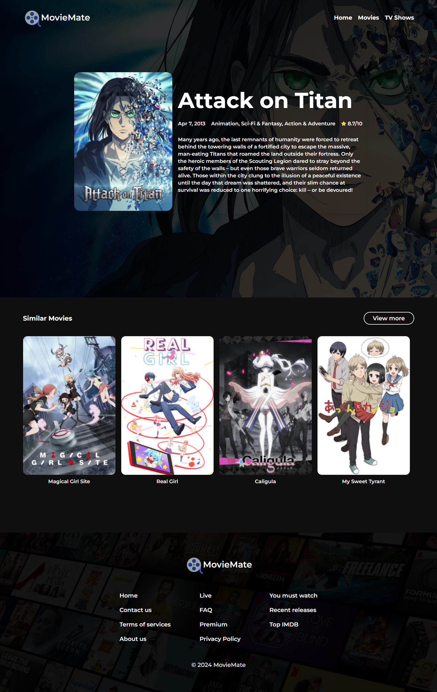

<h1 align="center" id="title">Movie App</h1>

<p align="center"></p>

<p id="description">This is a user-friend & simple movie app that helps users to discovery and search for a movie to watch</p>

<h2>🧐 Features</h2>

Here're some of the project's best features:

- Discover Movies/TVShows
- Search for Movies/TVShows
- Detailed info about Movies/TVShows

<h2>🛠️ Installation Steps:</h2>

<p>1. Clone the project</p>

```
git clone https://github.com/oiibar/MovieMate.git
```

<p>2. Install packages</p>

```
npm i
```

<p>3. Run the client</p>

```
npm run dev
```

<h2>💻 Built with</h2>

Technologies used in the project:

- ReactJS
- NextJS
- TypeScript
- ReactQuery
- TMDB Api
- TailwindCSS

Here are some screenshots of the project:

<p align="center">
  
  
  
</p>

<h2>💖Like my work?</h2>

Feel free to contact me<p><a href="contact-me-neon.vercel.app">contact-me-neon.vercel.app</a></p>
